## 🛠️ What I build

I like systems that are **fast, honest and revertible** — on Windows and Linux.

<table>
<tr>
<td width="33%" valign="top">

### ⚡ [ad-hyperoptimize](https://github.com/zCrxticxl/ad-hyperoptimize)

Windows optimization suite — Tauri 2 + Rust + React. Health scoring, live metrics, journaled tweaks with one-click revert. **Zero snake oil, zero telemetry.**

`Rust` `Tauri` `TypeScript`

</td>
<td width="33%" valign="top">

### 🐧 [adhyper-linux](https://github.com/zCrxticxl/adhyper-linux)

Deep Linux updater, cleaner & performance tuner. 15 modules, TUI, dry-run, fully revertible. Arch / Debian / Fedora / openSUSE.

`Bash` `systemd` `sysctl`

</td>
<td width="33%" valign="top">

### 🍚 [adrice](https://github.com/zCrxticxl/adrice)

Rice your whole Linux desktop from one TUI — full themes from any wallpaper, live previews, one-key fixes, undo everything.

`Bash` `GNOME` `KDE` `Hyprland`

</td>
</tr>
</table>

## 🎯 Off the keyboard… still on the keyboard

Competitive **Rainbow Six Siege** player & team manager. That's where the obsession with input latency, frametimes and DPC spikes comes from — my tools exist because I wanted them for my own setup first (5800X / RTX 4080).

## 📊 Stats

⭐ a repo if it helps you — that's the whole business model.

