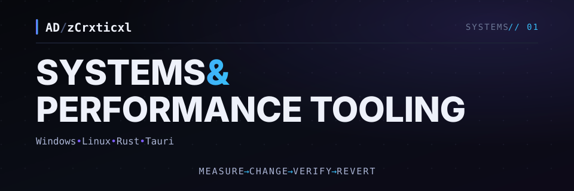

## What I build

I build safe, measurable, and reversible tools for Windows and Linux. My focus is Rust, Tauri, TypeScript, Bash, desktop software, performance diagnostics, and practical system tooling.

My projects are source-available for private and other non-commercial use. Commercial licensing and support may be available. Each repository states its current license and security-reporting route.

### [AD HyperOptimize](https://github.com/zCrxticxl/ad-hyperoptimize)

Windows performance and diagnostics suite built with Tauri, Rust, and React. It uses health scoring, live metrics, journaled changes, and one-click revert.

`Rust` `Tauri` `TypeScript` `Windows`

### [Clav.Strats](https://github.com/zCrxticxl/clav-strats)

Cross-platform Rainbow Six Siege strategy planner with a map editor, local strategy library, import/export, and optional live collaboration.

`React` `Tauri` `JavaScript` `Desktop app`

### [AD HyperOptimize Linux](https://github.com/zCrxticxl/adhyper-linux)

Linux maintenance and performance tuning with 15 modules, a TUI, dry-run mode, and full revert support for Arch, Debian, Fedora, and openSUSE.

`Bash` `systemd` `sysctl` `Linux`

### [adrice](https://github.com/zCrxticxl/adrice)

Terminal-first Linux desktop theming with wallpaper palettes, live preview, a built-in doctor, and full undo support.

`Bash` `GNOME` `KDE` `Hyprland`

## Why this work

I play Rainbow Six Siege competitively and manage a team. That experience drives my interest in input latency, frametimes, DPC behavior, and dependable desktop tooling. I build tools I want to trust on my own setup first.

I am open to collaboration around Rust, Tauri, Windows performance, Linux tooling, and desktop UX.

## Contributions

If a project helps you, a star or useful issue report is appreciated.

